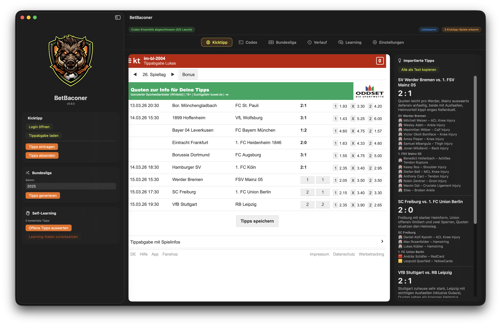

# BetBaconer


BetBaconer ist eine native macOS-App, die Bundesliga-Tipps für Kicktipp automatisch vorbereitet, per lokaler KI analysiert und auf Wunsch direkt in die Kicktipp-Tippabgabe einträgt. Mit einem kleinen Augenzwinkern gesagt: Der Keiler macht dir die Tipps speckfett.

Technisch kombiniert die App Bundesliga-Daten, Wettquoten, Ausfallinformationen, Wetterdaten und frühere Vorhersagen zu einem strukturierten Prompt, führt mehrere lokale Codex-Läufe aus und aggregiert daraus einen konsolidierten Tippvorschlag.



BetBaconer ist für den lokalen Einsatz auf macOS als gehärtete `v1` ausgelegt:
- keine OpenAI-API-Schlüssel in der App
- lokale Modell-Ausführung über Codex CLI
- sicher gespeicherte Drittanbieter-Secrets im macOS-Keychain
- reproduzierbare Build- und Test-Pipeline über SwiftPM und GitHub Actions

## Kernfunktionen

Mit einem Lauf über **"Tipps generieren"** durchläuft die App folgenden Workflow:

1. Bundesliga-Saisondaten über OpenLigaDB laden
2. Wettquoten über The Odds API laden, mit Kicktipp-DOM als Fallback
3. Verletzungen und Sperren über SofaScore verdichten
4. Team-, Stadion- und Ortsdaten über TheSportsDB laden
5. Wetterprognosen über Open-Meteo anreichern
6. Frühere Vorhersagen für denselben Spieltag als Konsistenzsignal einbeziehen
7. Mehrere Codex-Läufe lokal ausführen und per Ensemble aggregieren
8. JSON-Antworten validieren, post-processen und lokal persistieren
9. Tipps in die Kicktipp-Tippabgabe eintragen und optional absenden

## Architektur

Die Anwendung besteht aus vier Hauptbereichen:

| Bereich | Verantwortung |
|---|---|
| SwiftUI App/UI | Bedienung, Statusanzeige, Browser-Einbettung |
| Workflow-Orchestrierung | Datenquellen laden, Prompt erzeugen, Ensemble ausführen |
| Services | OpenLigaDB, The Odds API, SofaScore, TheSportsDB, Open-Meteo, Codex CLI |
| Persistenz | Learning-Store, Tipp-Verlauf, Keychain-Secrets |

Wichtige Dateien:
- [Sources/AppState.swift](Sources/AppState.swift): zentrale Workflow-Orchestrierung
- [Sources/KicktippAutomation.swift](Sources/KicktippAutomation.swift): Kicktipp-WebView- und DOM-Automation
- [Sources/TipWorkflowService.swift](Sources/TipWorkflowService.swift): Prompt-Aufbau und JSON-Parsing
- [Sources/EnsembleService.swift](Sources/EnsembleService.swift): Mehrheitsaggregation
- [Sources/PredictionStore.swift](Sources/PredictionStore.swift): Learning-Persistenz
- [Sources/TipHistoryStore.swift](Sources/TipHistoryStore.swift): Tipp-Verlauf
- [Sources/KeychainSecretStore.swift](Sources/KeychainSecretStore.swift): sichere Secret-Speicherung

## Datenquellen

| Quelle | Zweck |
|---|---|
| OpenLigaDB | Ergebnisse und Spielplan der Bundesliga |
| The Odds API | Marktquoten für den nächsten Spieltag |
| Kicktipp DOM | Quoten-Fallback und Tippformular |
| SofaScore | Verletzungen und Sperren |
| TheSportsDB | Team- und Stadion-Metadaten |
| Open-Meteo | Geocoding und Wetter zur Anstoßzeit |
| Lokale Historie | Konsistenzsignal früherer KI-Läufe |

## Analysemodell

Die Prompt-Erzeugung berücksichtigt unter anderem:
- gewichtete Teamform
- Punkte, Tore, Gegentore und Tordifferenz pro Spiel
- Heim- und Auswärtsform getrennt
- Tabellenkontext
- Resttage
- Head-to-Head mit geringer Gewichtung
- Marktquoten und implizite Wahrscheinlichkeiten
- Verletzungen und Sperren
- Stadion- und Ortsdaten
- Wetter zur Anstosszeit
- historische Konsistenz früherer Vorhersagen
- regelbasierte Nachkorrekturen aus ausgewerteten Vorhersagen

Das Modell gibt exakt JSON zurück. Mehrere Läufe werden aggregiert:
- Primär über Mehrheitsentscheidung
- bei Gleichstand über Marktausrichtung
- anschließend über konservativere Scoreline

## Sicherheits- und Produktionsmerkmale

BetBaconer ist auf sicheren lokalen Betrieb ausgelegt:

- Der The-Odds-API-Key wird im macOS-Keychain gespeichert, nicht in `UserDefaults`.
- Externe Netzwerkanfragen verwenden zentrale Session-Konfiguration mit Timeouts.
- Der Workflow bricht kontrolliert ab, wenn für den Spieltag keine vollständige Quotenabdeckung vorliegt.
- Ein Codex-Ensemble gilt nur dann als erfolgreich, wenn eine Mindestanzahl von Runs erfolgreich war.
- Learning-Daten und Tipp-Verlauf werden atomar lokal gespeichert.
- Die App schreibt strukturierte Laufzeitlogs über `OSLog`.

## Voraussetzungen

- macOS 14+
- Xcode Command Line Tools oder Xcode mit Swift 6 Toolchain
- installierte und angemeldete [Codex CLI](https://github.com/openai/codex)
- optional: The-Odds-API-Key für primäre Quotenversorgung

## Konfiguration

In der App können folgende Werte gesetzt werden:

| Einstellung | Beschreibung |
|---|---|
| `Codex Pfad` | Pfad zur installierten Codex CLI |
| `Competition Slug` | Kicktipp-Runden-Slug für die Tippabgabe |
| `The Odds API Key` | wird sicher im macOS-Keychain gespeichert |
| `Codex-Läufe` | Anzahl der Ensemble-Runs pro Analyse |
| `Nachkorrektur aktiv` | regelbasierte Learning-Nachkorrektur |

Zusätzlich kann `THE_ODDS_API_KEY` als Umgebungsvariable verwendet werden. Beim Speichern in der App wird der Wert in den Keychain übernommen.

## Build, Test und Start

```bash
swift build
swift test
swift run
```

## Kontinuierliche Integration

Es ist eine GitHub-Actions-CI enthalten:

- Build auf `macos-14`
- `swift build`
- `swift test`

Datei: [`.github/workflows/ci.yml`](.github/workflows/ci.yml)

## Persistenz

BetBaconer speichert lokale Daten in `Application Support/BetBaconer`:

- `learning-store.json`: ausgewertete Vorhersagehistorie
- `tip-history.json`: importierte bzw. erzeugte Tipps pro Spieltag

Secrets werden nicht dort abgelegt, sondern separat im macOS-Keychain gehalten.

## Betriebsgrenzen

Die Anwendung ist intern auf Produktionsniveau gehärtet, aber einige Betriebsrisiken liegen naturgemäß außerhalb des eigenen Codes:

- Kicktipp wird über WebView- und DOM-Automation integriert; HTML-Änderungen auf Kicktipp können die Automation beeinflussen.
- Drittanbieter-APIs können sich in Verfügbarkeit, Format oder Rate Limits ändern.
- Die Vorhersagequalität bleibt trotz Learning- und Ensemble-Logik probabilistisch und nicht deterministisch korrekt.

## Antwortformat der Modellausgabe

```json
{
  "tips": [
    {
      "spieltag": 26,
      "heim": "Team A",
      "gast": "Team B",
      "tore_heim": 2,
      "tore_gast": 1,
      "rationale": "Starke Heimform, passende Quoten, Ausfälle beim Gast."
    }
  ]
}
```

## Entwicklungsstatus

Stand dieser README:
- Build und Test über SwiftPM eingerichtet
- Produktionsnahe lokale Ausführung auf macOS vorgesehen
- First-commit-fähige Dokumentation ohne offene Platzhalter oder TODO-Notizen
